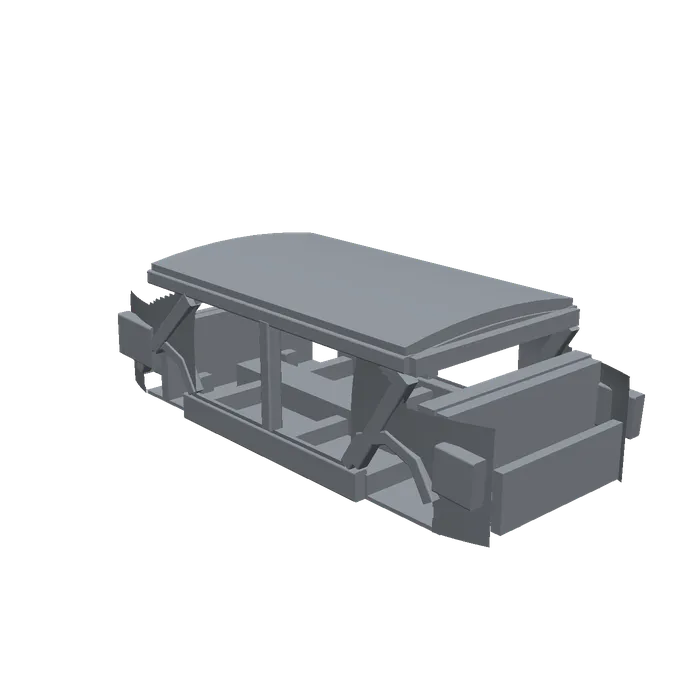

# biw-sedan — ボディインホワイト (コンパクトセダン)

溶接デモ用のワークピース (CC0-1.0)。特定車種の複製ではない汎用 BIW。
**`collision_mode: authored`(weld-line-requests.md #3)の実証アセット**でもある。



## 構成

- **ジョイントレスの単一リンク** `biw`。カタログ側は `category: workpiece` /
  `articulated: false` として「ロボットではなく障害物」を宣言する
- 全長 4.16 / 全幅 1.76 / 全高 1.28 m、質量 300 kg
  (クロージャ・ガラス・内装なしの BIW 実勢値)
- 原点は車体中心・床パン基準 = 治具の位置決め点。
  X = 車両前後 (前が +X)、Y = 左右、Z = 上

BIW なのでドア・ボンネット・トランクリッド(クロージャ)は付かない。
エンジンルームとトランクが開いているのは正しい状態。

## 実開口 (溶接ロボットが通せる場所)

| 開口 | 囲む部材 |
|---|---|
| 前ドア開口 (左右) | A ピラー / B ピラー / ロッカーシル / ルーフレール |
| 後ドア開口 (左右) | B ピラー / C ピラー / ロッカーシル / ルーフレール |
| ウインドシールド | 左右 A ピラー / カウル / フロントヘッダ |
| バックライト | 左右 C ピラー / リアバルクヘッド / リアヘッダ |
| ホイールアーチ ×4 | アーチ材の内側 (弧に沿って構造だけを置く) |

## visual / collision

**visual と collision を分離してある。** collision は「凸ピースの compound」という
制約があるが、visual にはそれが無い。分離したことで曲面外板を張れるようになった。

- **visual** = `meshes/visual/biw.glb`(16,052 面、色付き)
  - 構造ピース(骨格)+ **曲面外板スキン** + クラウンルーフ
  - 外板はビルトラインから上を絞り(タンブルホーム)、前後端も平面視で絞る。
    ベルトラインはキャビンからフェンダー/デッキへ落ちる。**どれも非凸**なので
    collision には使えない形
  - 開口(前後ドア・ホイールアーチ)はセルを張らないことで**実開口**にしている
  - glb なのは色を運べるから。builder が OBJ+MTL に正規化して色ごと通す
- **collision** = `meshes/collision/<name>.stl` を **49 個の凸ピースとして個別出力**

各ピースは直線区間ごとの loft を凸包に丸めたもので、**全ピースが凸**
(生成時に検証。消費側は凸 compound としてそのまま使えるので VHACD 不要)。

**リンク単位でマージ + 穴埋めしてはいけない。** ドア開口・ホイールアーチ・窓が
塞がって衝突形状として壊れる。builder は recipe の `collision_mode: authored`
でこの経路を素通しし、manifest にも `collision_mode: authored` を出すので、
消費側はそれを見て凸分解をスキップできる。

## USD 版 (`usd/biw-sedan.usda`)

同じピース集合を **UsdPhysics** でも出力する。各ピースが `CollisionAPI` +
`purpose=guide` + **`physics:approximation = convexHull`** を持つので、
「凸分解にかけるな」という契約が catalog 独自フィールドではなく**標準の形**で載る
(Isaac Sim / PhysX / three-usd-robot がそのまま解釈できる)。

カタログはこの属性から `collision_mode: authored` を導出するため、
`ingest: usd` のレシピは collision_mode を宣言しなくてよい。

## 再生成

```sh
python biw-sedan/tools/generate_meshes.py
```

`urdf/biw-sedan.urdf` と `usd/biw-sedan.usda` も**このスクリプトが生成する**(49 個の collision 参照と
慣性をピース一覧から起こすため)。手で編集しないこと。寸法定数はスクリプト冒頭の
GEOMETRY ブロックに集約してある。

質量配分は薄板構造に合わせて**表面積**比(体積比だと面積の割に体積の大きい
ルーフ・床パンに寄って重心が上がってしまう)。重心は z = 0.632 m。
