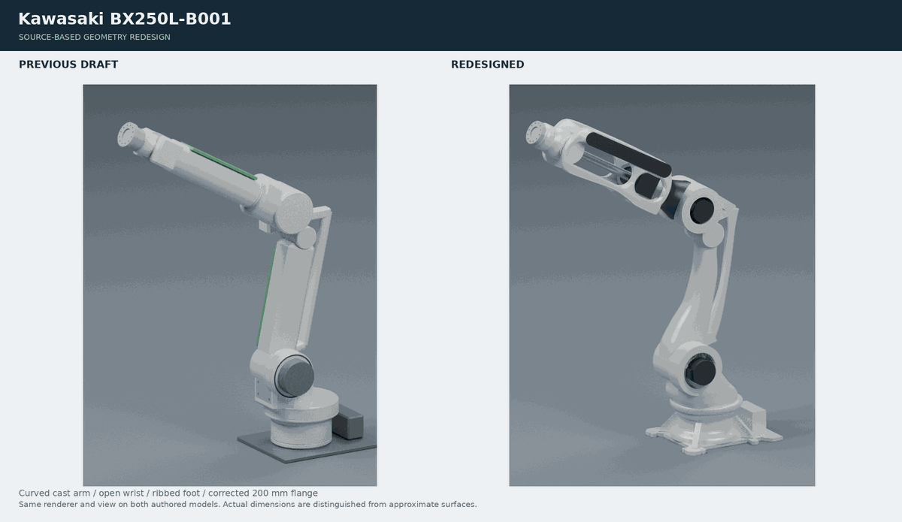

# Kawasaki BX250L-B001 reference model

Independently authored CC0 kinematic and visual reference of the BX250L-B001 with GUN BRACKET 160. Six commanded axes and two mimic joints preserve the documented parallel-link mechanism. This is not manufacturer CAD, a calibrated controller model, or a certified collision model.

## Source-based visual redesign (r3, unpublished)

The earlier unpublished draft mostly finished boxes/cylinders and did not adequately match the real machine. This version replaces those silhouettes: a curved tapered main-arm casting, cast offset carrier and parallel link, a ribbed/lobed base, motor volumes, dark service covers, tapered swivel housing, and a long **open, variable-thickness wrist yoke**. The previous green rectangular covers and speculative screw arrays are removed. The external GUN BRACKET 160 diameter is corrected from **210 to 200 mm**.

| Quantity | Source | Model |
| --- | --- | --- |
| J1/J2 height; J2 offset | 90151-0028DED: 670 / 210 mm | 670 / 210 mm |
| J2 to carrier | Same drawing: 1100 mm | 1100 mm |
| Carrier to J3 | Same drawing: 185 mm forward, 270 mm up | 185 / 270 mm |
| J3 to J5; J5 to flange | Same drawing: 1350 / 343 mm | 1350 / 343 mm |
| Zero-pose flange | Drawing, checked against numeric STEP axes | (0, 2088, 2040) mm, outward +Y |
| Axis limits J1..J6 | BX250L specification, degrees | ±180, −60..76, −120..90, ±210, ±125, ±210 |
| Axis speeds J1..J6 | BX250L specification, degrees/s | 125, 120, 100, 140, 140, 200 |
| Base footprint | 90151-0028DED: 750 × 875 mm | 750 × 875 mm cast-foot envelope |
| Base nominal bores | Installation drawing: 8×Ø22, 500/600/700 mm dimension chains | 8 visual Ø22 bores; no anchor or tolerance model |
| Flange outside diameter | B-series BS2009 M, wrist diagram, PDF page 3: Ø200 | **Ø200**, corrected from Ø210 |
| Tool interface | PCD160, 10×M10, Ø100 H7 recess depth 11, 2×Ø10 H7 pins | Existing axes/recess retained; no threads or toleranced fits |
| Wrist vertical envelope | Same wrist diagram: +237 / −196 mm about J5 | Cast envelope authored within those nominal bounds |
| Parallel rod pivots | Numeric STEP cylinder axes | Y−183.923, Z739.459 / 1839.459 mm; axial placement X287 mm remains authored |

## Evidence and limits

- [Official current BX250L product photo](https://kawasakirobotics.com/tachyon/sites/4/2022/02/BX250L_GA20250312small.png): curved cast-arm silhouette, ribbed foot, dark service covers, exposed motor volumes and open wrist construction. Paint appearance is photo-informed; no trademark image is copied.
- [BX250L specification/drawing 90151-0028DED](https://kawasakirobotics.com/uploads/sites/2/2022/01/BX250L-B_E-E.pdf): link centers, footprint, mount pattern and kinematic dimensions.
- [B-series BS2009 M brochure](https://kawasakirobotics.com/uploads/sites/2/2022/01/brochure_robots_large-payload-robots_us-en_01_2021.pdf): **BX250L/BX300L** wrist figure identifies Ø200 and +237/−196. The neighboring Ø210 figure is for other variants and must not be substituted.
- [BX250L-B001 STEP](https://kawasakirobotics.com/uploads/sites/2/2022/01/BX250L-B001-STEP.zip): existing numeric dimensions/pivot axes only. No imported surfaces, tessellation, or traced contours are shipped.
- [Official BX mechanism convention](https://github.com/Kawasaki-Robotics/khi_ros2/blob/32a34658cd80343bfe7b7fb82cabce3bfd2b4381/khi_description/urdf/bx/khi_joint_link.xacro): joint signs/parallel-link convention, not BX300L dimensions or dynamics.

`tools/reference_geometry.py` contains independently chosen profiles. Undimensioned cast radii, wall thicknesses, taper, motor/connector details and aperture outlines are approximate. Public photos establish component layout, not hidden dimensions. The official photo identifies BX250L; exact B001 individual/manufacturing-year configuration is unconfirmed. Cable routing, full internal mechanisms, exact surface clearances, masses/inertias and forces are not validated.

### Collision and compatibility

Root `base_link`, all links/joints, axes, mimic relations, joint limits and flange frame remain unchanged. Flange +Z follows the output axis; local X is world +Z and local Y is world +X at zero.

**Collision primitives are intentionally revised** along with the corrected shape. The wrist uses separated rail/root/shaft primitives, rather than the old solid forearm cylinder filling the new opening; arm/base envelopes and the Ø200 flange envelope are updated. These are coarse analytic approximations, not a guaranteed enclosing envelope, manufacturer swept volume, or exact casting cavities. Small motors/connectors and casting extrema may be omitted or undercovered. Flexible items have no collision. No mass, inertia or effort is invented. Existing assembly compatibility is described in [BX-NIMAK-HW-A](../nimak-multiframegun/docs/assembly.md).

## Regenerate and validate

From the repository root, with the existing `authoring/reference-requirements.txt` installed:

```sh
python kawasaki-bx250l/tools/generate_model.py
python kawasaki-bx250l/tools/generate_model.py --check
python -m unittest discover -s authoring/tests -p 'test_reference_models.py'
python -m unittest discover -s authoring/tests -p 'test_visual_detail.py'
```

The older `authoring/visual_detail.py --check` command is a compatibility wrapper around the full current generators; the obsolete frozen-box-bound postprocessor is no longer used. Standard URDF/STL remain in metres and Z-up. `authoring/render_reference.py` renders iso/side/front/top and an explicitly estimated source-photo pose with Blender. Only authored renders, not manufacturer photos/drawing pages, are included under this repository's CC0 license.



This prepares a new **unpublished r3**. Published r2 remains pinned to its old commit; no existing catalog revision is replaced in place.
