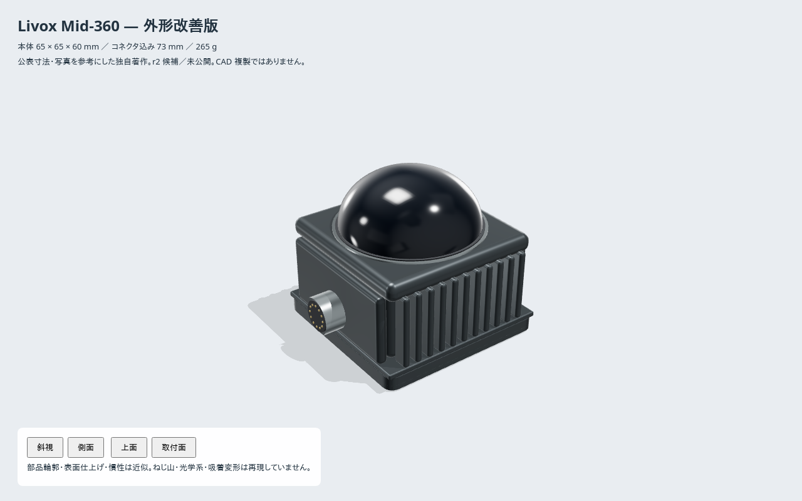

# Livox Mid-360 — 外形改善版 r2 候補

参照実機は **Livox Mid-360**。旧 `../urdf/` と `../meshes/*.stl` を変更せず、
[新しい USD](../usd/mid-360.usda) を Three.js + three-usd-robot で独自著作した。
メーカー CAD・写真・図面は同梱していない。まだ公開カタログには反映していない。

## 寸法と変更

| 項目 | 公表値 / 図面値 | r2 |
|---|---|---|
| 本体包絡 | 65 × 65 × 60 mm | 一致。旧モデルのフィンによる幅超過を解消 |
| コネクタ込み | 73 mm | 一致 |
| 点群原点 | 底面 +47 mm | `livox_frame` に維持 |
| 底面取付 | 4-M3 深さ5、ピッチ48 × 36 mm | 平滑な盲穴として実形状化 |
| 位置決め | 径/幅3、深さ1.8、間隔39 mm | 円穴 + 長穴。長穴の長さは推定 |
| 質量 | 265 g | 維持 |
| 表面 | 写真参照 | グラファイト筐体、金属リム、光学窓、絶縁体、接点の5材質 |

出典: [公式仕様](https://www.livoxtech.com/mid-360/specs)、
[公式 Quick Start Guide v1.8](https://dl.djicdn.com/downloads/Livox/Mid-360/QSG/Livox_Mid-360_Quick_Start_Guide_multi.pdf)
PDF 6ページ（印刷ページ5）の公表寸法。数値と推定を分けた記録は
[provenance.json](provenance.json)。



[側面](../docs/r2-side.png) · [上面](../docs/r2-top.png) · [取付面](../docs/r2-bottom.png)

## 精度の範囲

フィンの本数・断面、ドームの輪郭、角丸、材質パラメータ、コネクタ接点位置は当方の近似。
メーカー固有のねじ山・はめあい公差・電気ピン配置は再現していない。
取付穴は visual のみで、3個の box/cylinder collision には小穴を掘らない。
内蔵走査機構・光学シミュレーション・熱解析は未実装。慣性と重心は旧モデルの近似値を維持。
root は底面中心、コネクタは -X、点群原点は底面 +47 mm の既存規約を保つ。
資料の「周囲に10 mmの空間」は放熱のためで、root を底面から浮かせる意味ではない。

## 再生成と検証

```sh
cd mid-360/authoring
npm ci
npm test
npm run export
npm run view
# http://localhost:8733/viewer.html
```

Node.js 22。依存を lockfile で固定し、表示と USD で `model.mjs` を共有する。
テストは包絡・盲穴の実深さ・フレーム・質量・衝突形式・出力再現性を確認する。
変換後の追加検証は builder のルートで:

```sh
.venv/bin/python eval/check_authored_fidelity.py mid-360 PACKAGE_DIR
```

[変換後の検証結果](../docs/r2-validation.json) は USD/USDC の材質・法線・衝突形式、
GLB の実形状へのレイ検査、URDF/USDC の点群フレームを確認したもの。
実機への組付け試験ではない。
取得元だけを一時ローカルGitに置き換えた全CLIビルドも V2（13 pass / 0 warn / 0 fail）で完了。
[標準検証レポート](../docs/r2-build-validation.json)。リモートの新版取得・公開は未実施。

公開時はアセットを commit/push し、builder の `eval/recipes/mid-360-r2.yaml` の
`fetch.ref` をそのフル SHA に固定して `recipes/livox/` へ移す。r1 は差し替えない。
