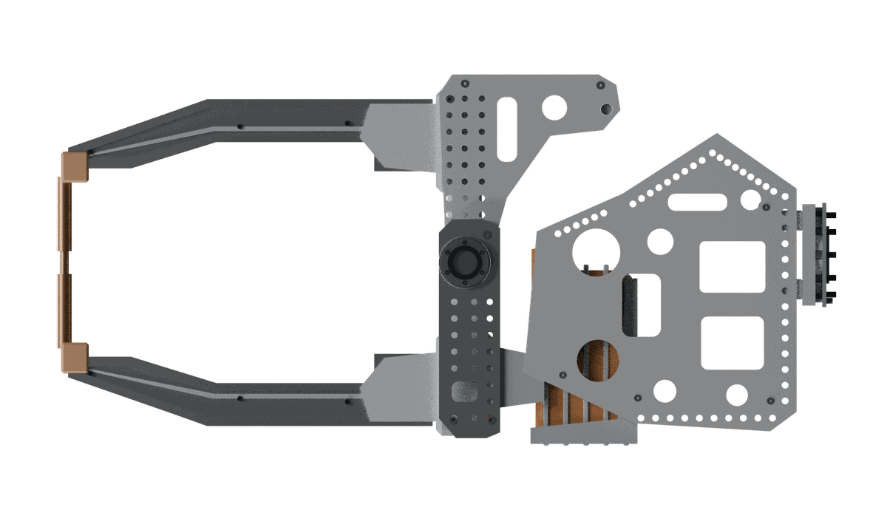
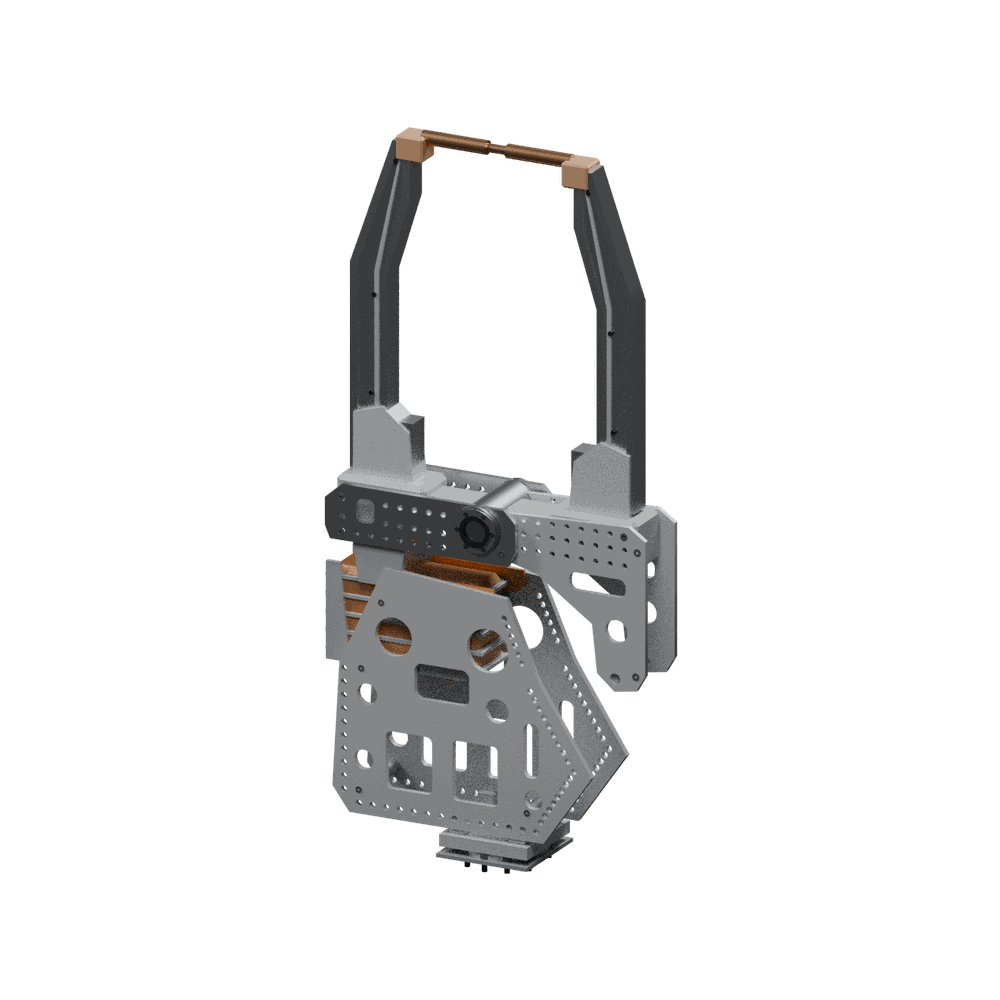

# NIMAK 95.020.516 / P3U reference model

An independently authored CC0 visual and mounting reference of the real NIMAK multiframeGUN 95.020.516 with P3U coupling, configured with [BX-NIMAK-HW-A replacement hardware](docs/assembly.md). The right jaw opens about the measured pivot using one joint. See [opening, commands and simulation limits](docs/opening.md). Physical opening limits and operating speed remain uncalibrated.

| Quantity | Source | Model |
| --- | --- | --- |
| Product and mount | NIMAK configurator: 95.020.516, multiframeGUN X, P3U | Same identifiers; no invented SKU |
| Coupling mating plane | Received 06.000.027-A: Z0 mm | `mount`, Z0 |
| Coupling / flange support planes | Received CAD: Z19 / Z42 mm | Fixed frames at 19 / 42 mm |
| Mount pattern | Received CAD: 10 clearance axes, PCD160, nominal Ø11 | Ten nominal visual Ø11 bores; [coordinates](docs/assembly.md) |
| Pilot | Received CAD: Ø100, 5 mm cylindrical + chamfer to 6 mm | Ø100 ×5 mm cylindrical approximation; chamfer omitted |
| Locating pin | Received CAD: X−80 mm, Ø10, Z−11..7 mm | Same nominal cylinder |
| Hardware | HW-A: MISUMI CB10-25 ×10, washer 1 mm | Separate bolt links; nominal Ø10×25 shafts, Ø16×10 heads, ten washers |
| Closed electrode contact | Received CAD: (−13.4, 0, 1332) mm | `cad_tip`, same coordinates; not a calibrated weld TCP |
| Jaw pivot | Received CAD: X−13.4/Z632 mm; Y axis | Same pivot and one moving jaw |
| Actuator pins | Received CAD: B=(−191.9, 0, 274), C(0)=(254.1, 0, 384) mm | Numeric nonlinear relation; optional inspection illustration only |
| Arm and frame appearance | [Exact official 95.020.516 illustration](https://www.nimak.com/fileadmin/user_upload/zangen_images/95.020.516.png) | Authored tapered silver arms, perforated raked sideplates, pivot spine and fork |
| Transformer | Received H3.53N.022-1 bounds; exact official illustration | Core within recorded bounds; brown/orange finish, support and terminals approximate |

Numeric source: user-supplied `95.020.516.stp`, SHA256 `1ed279a1b42623fa618aedf65ea5bf3ef77123daf4f3ea724b82b716f8b9e73d`. The file is not redistributed. Only measured numeric facts are used. No vendor mesh, CAD surface, automatic contour trace or vendor image is shipped as CC0 geometry. Product identification comes from the [NIMAK configurator](https://www.nimak.com/en/weldinggunconfigurator/). `LRN 300-001-` is not a verified drive model or a stroke measurement.

## Source-reference visual revision r5 (unpublished)

This prepares a new visual revision, without replacing a published revision at its pinned commit. Catalog publishing is separate.

The prior rectangular chassis and copper-colored bar arms have been rebuilt. The gun now has two slanted, genuinely perforated sideplates; a drilled fixed pivot spine; paired shaped moving-fork plates; recessed tapered silver arms; short terminal clamps; and a supported transformer assembly. The visible holes and recesses are geometry, not painted circles. Copper coloring is limited to the existing electrode/holder components and adjacent approximate terminal clamps.

The official illustration matches the 95.020.516 designation; a complete match of its coupling/drive options to the received P3U CAD has not been verified. The measured P3U interface contract comes from that CAD.

The detailed shape is an **independent visual approximation**, not a reconstruction accurate enough for fabrication. Plate thicknesses, decorative hole patterns, pocket shapes, fastener locations, material finishes and unseen cross-bracing are authored choices. The [source and evidence record](docs/source-reference.md) separates the exact variant reference from family-level appearance evidence.

The complete nonvisual URDF is unchanged: link frames, joint origin/axis/limits, the mounting/contact geometry and collision primitives retain their previous contracts. The original mounting plate, pilot, locating pin, coupling housing, flange, bolt shafts, washers, electrode holders and contact electrodes are preserved. The CB10-25 heads retain nominal Ø16×10 envelopes with illustrative blind hex sockets.





[Exported geometry at the 20° simulation setting](docs/source-reference-open.png) shows the same fixed and moving link geometry; the actuator is omitted.

Collision geometry remains the existing separate boxes/cylinders, preserving the throat opening. It intentionally does not reproduce the new visual recesses or all plate outlines, fills mount bores, and omits fasteners/pins. It is unsuitable for detailed clearance or machining checks. Hoses, flexible conductors, electrical/water routing, per-link inertia, active squeeze force and process readiness are not modeled.

The nonlinear actuator remains absent from the simulation URDF. A separate optional preview can illustrate its pose using the measured B/C endpoints, with visibly documented **unmeasured barrel, rod and motor envelopes**. It is not a static actuator accidentally attached to the moving gun.

`order.requires` in the catalog lists the ten separately purchased CB10-25 screws. They are already visible here; do not attach a second set. Coupling and flange are included once. This engineering configuration is not a manufacturer-supported Kawasaki/NIMAK kit.

## Regeneration and checks

From the repository root:

```sh
python -m pip install -r authoring/reference-requirements.txt
python nimak-multiframegun/tools/generate_model.py
python nimak-multiframegun/tools/generate_model.py --check
python -m unittest discover -s nimak-multiframegun/tools -p 'test_*.py'
python -m unittest discover -s authoring/tests -p 'test_reference_models.py'
```

`generate_model.py` contains the measured mounting and kinematic constants. It calls the asset-owned `reference_geometry.py` for visible shapes. The old generic box-finishing pass and frozen primitive bounds are retired for this asset.

The URDF uses metres/radians, `mount` as root and local +Z into the gun. `jaw_opening` controls the right arm; `moving_tip` follows its electrode. The 0–20 degree range and 0.2 rad/s velocity are simulation settings, not manufacturer maximums. Prebuilt catalog URDF/USD need no authoring environment.

To reproduce the inspection views with Blender (the `.blend` output is review-only):

```sh
blender -b -t 6 --python nimak-multiframegun/tools/render_reference.py -- nimak-multiframegun/urdf/95-020-516-p3u.urdf /tmp/nimak-side.png 0 --side
blender -b -t 6 --python nimak-multiframegun/tools/render_reference.py -- nimak-multiframegun/urdf/95-020-516-p3u.urdf /tmp/nimak-open.png 20
# Optional pose-derived, unmeasured drive-envelope illustration:
blender -b -t 6 --python nimak-multiframegun/tools/render_reference.py -- nimak-multiframegun/urdf/95-020-516-p3u.urdf /tmp/nimak-drive-preview.png 10 --side --actuator-envelope
```
