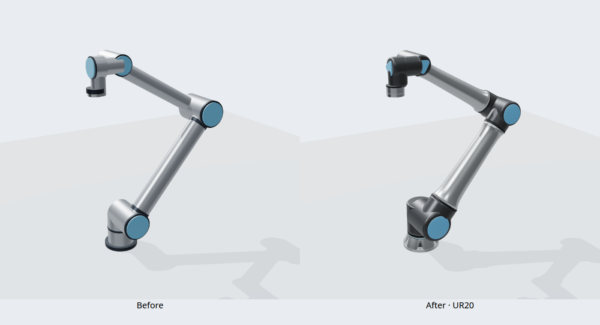
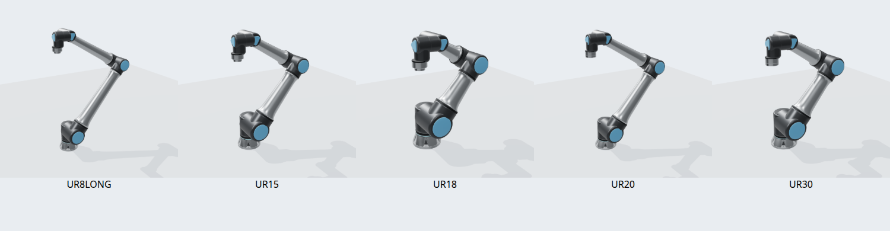

# Universal Robots UR Series — 独自形状の参照モデル

参照実機は **UR8 Long、UR15、UR18、UR20、UR30**。表示形状と衝突用の近似形状は
CC0-1.0の独自著作。メーカーのCAD、DAE、STL、画像、テクスチャは取り込んでいない。
公開カタログの `universal_robots/ur/{ur8-long,ur15,ur18,ur20,ur30}/r2` は旧SHAに固定されている。
このソースの外観更新は **r3向け（未公開）**。公開済みr2の取得元・中身は変更しない。





運動学、関節制限、慣性は、公式の
[Universal_Robots_ROS2_Description](https://github.com/UniversalRobots/Universal_Robots_ROS2_Description/tree/89bbe795f38a7ab00fb66fe8831dfff79dc99edf)
の **BSD-3-Clauseのコード・数値設定**をbuilderが別途取得する。
このディレクトリはそれらを再ライセンスしない。上流 `meshes/` は取得・配布しない。
`urdf/reference.urdf.xacro` は公式マクロに独自のvisual設定を渡す。

| 参照実機 | 公式default_kinematics: d1 / a2 / a3 / d4 / d5 / d6 (mm) | 本モデル |
| --- | --- | --- |
| [UR8 Long](https://www.universal-robots.com/products/ur8-long/) | 218.6 / 898.9 / 714.9 / 182.4 / 136.1 / 143.4 | 同じ関節原点 |
| [UR15](https://www.universal-robots.com/products/ur15/) | 218.6 / 647.5 / 516.4 / 182.4 / 136.1 / 143.4 | 同じ関節原点 |
| [UR18](https://www.universal-robots.com/products/ur18/) | 218.6 / 475 / 338.9 / 182.4 / 136.1 / 143.4 | 同じ関節原点 |
| [UR20](https://www.universal-robots.com/products/ur20/) | 236.3 / 862 / 728.7 / 201 / 159.3 / 154.3 | 同じ関節原点 |
| [UR30](https://www.universal-robots.com/products/ur30/) | 236.3 / 637 / 503.7 / 201 / 159.3 / 154.3 | 同じ関節原点 |
| UR8 Long / UR15 / UR18 工具側 | ISO 9409-1-50-4-M6 | 50 mm PCD、4穴＋位置決め穴。ねじ山・公差は省略 |
| UR20 / UR30 工具側 | ISO 9409-1-80-6-M8 | 80 mm PCD、6穴＋位置決め穴。同上 |

数値の出典は上記固定コミットの各 `config/<type>/default_kinematics.yaml`、フランジは
製品データシート。a2/a3は表では長さの絶対値、実際の関節並進は負のX。
ブラウザ用の関節ツリーは読みやすい理想角度で記述するが、カタログは上流の微小な
並進・回転を含む完全なマクロ出力を使用する。`tool0`と6駆動関節名を維持する。

## r3の外観と寸法の出典

2026-09-11に公式製品写真と以下の公開データシートを確認した。
写真や寸法図の画素・輪郭・メーカーCADは出力へ取り込んでいない。

- [UR15データシート](https://www.universal-robots.com/manuals/latest/en/datasheets/ur15/)
- [UR18データシート](https://www.universal-robots.com/manuals/latest/en/datasheets/ur18/)
- [UR20データシート](https://www.universal-robots.com/manuals/latest/en/datasheets/ur20/)
- [UR30データシート](https://www.universal-robots.com/manuals/latest/en/datasheets/ur30/)
- [UR8 Long製品ページ](https://www.universal-robots.com/products/ur8-long/)

| 対象 | 公表値 | 採用値・扱い |
| --- | --- | --- |
| UR8 Long / UR15 / UR18 ベース外径 | Ø204 mm | Ø204 mm（旧形状はØ196 mm） |
| UR20 / UR30 ベース外径 | Ø245 mm | Ø245 mm（旧形状はØ220 mm） |
| UR15 ベース取付パターン | PCD180、6×M10 | 小型3機種の描画用穴をPCD180に配置。穴径Ø11・板厚17 mmは近似 |
| UR20 / UR30 ベース取付パターン | PCD210、6×M10 | PCD210に配置。穴径Ø11・板厚17 mmは近似 |
| UR15 工具面・インロー | 外径Ø63、インローØ31.5、深さ6.2 mm | 小型3機種の共通形状として同値を採用。UR8 Long / UR18の細部寸法は共通系列からの推定 |
| UR20 / UR30 工具面・インロー | 外径Ø100、インローØ50、深さ6.2 mm | 同値を採用（旧大型形状の外径はØ90 mm）。中心を貫通穴から凹面へ修正 |
| UR15 工具ハウジング | 外径Ø90 mm | 小型3機種にØ90 mmを採用、軸方向形状は近似 |
| アーム | テーパ管（公式製品ページの説明） | 両端を広げ、中央へ滑らかに絞る独自回転断面 |
| 関節・手首のカバー | 公式製品写真の円形／丸みを持つ三角形 | 寸法・曲率・色は写真からの近似 |

上表の小型共通化は同じ取付規格・系列を基にした外観上の採用であり、
UR8 Long / UR18の取付細部をUR15の寸法図だけで検証済みとはしない。
公式製品ページの共通説明には大型機にも50-4-M6と書かれた箇所があるため、
工具規格は機種別データシートの80-6-M8を優先した。

取得資料の識別用SHA-256（メーカーPDF自体は同梱しない）:

```text
UR15: 4204b5fb099fc0e78cf8452f91eda3cafc8f6dcf9ce9d84451954b2089614c5c
UR20: e2c52bcd25d06b25322e66e8f5540db120d3497756725124dabd384bec76813a
```

筐体の独自近似値は `authoring/model.mjs` の `appearance` に集約した。
肩／肘／手首半径は小型89／68／50 mm、大型102／81／58 mm。
鋳造部の接続形状、ベルマウス断面、面取り、ベース開口、カバーの膨らみは
`authoring/visual.mjs` で再生成できる。これらは公表された製造寸法ではない。

## 表現範囲

r3では濃いグレーの関節筐体、テーパ管、継ぎ目、青いカバー、
ベースの6個のアクセス開口・表示リング、手首のセンサ筐体・工具I/O外形を追加した。
表示リングは一定色の外観のみで、実機の状態表示・発光を模擬しない。
I/Oのピン配置と取付位置は説明用の近似で、配線・接続仕様として使用しない。
ロゴ、外部ケーブル、取付ボルト、シリアル固有の校正、ねじ山・公差は含まない。

各関節に独立した形状を持ち、工具接触面はwrist_3原点に置く。
**関節ツリー・運動学・慣性・collision JSONはr2から変更していない。**
穴や筐体細部はvisualのみ。従来のcollisionは今回の大径化や詳細形状を包絡せず、
実機の取付適合・狭い隙間・自己干渉の可否を確定するモデルではない。
公式の慣性は維持し、近似筐体から質量を再推定しない。公称製品質量とURDFリンク質量和は
一致するとは限らない。条件付き最大可搬質量を無条件の公称可搬質量へ置き換えない。

材質はアルミ、グレー筐体、樹脂カバー、シール、鋼を個別に設定した。
色・金属度・粗さは測色値ではなく外観近似。OBJ/MTLには `Kd / Ks / Ns` と
PBR拡張の `Pm / Pr` を保存する。通常のMTL読込ではPhong近似になり、
PBR拡張の利用は読込側に依存する。[OBJ/MTL読戻し画像](docs/ur20-obj-r3.png)も保存した。
カタログのUSD・GLBやBotrail Studioへの変換後の材質は今回未検証。

## 再生成・表示

リポジトリのルートで:

```sh
npm --prefix universal-robots-ur-series/authoring ci
npm --prefix universal-robots-ur-series/authoring run export
npm --prefix universal-robots-ur-series/authoring test
npm --prefix universal-robots-ur-series/authoring run check
python3 -m http.server 8737 --bind 127.0.0.1
```

`http://127.0.0.1:8737/universal-robots-ur-series/authoring/` で5機種を切り替えられる。
Three.jsで手続き的にOBJ/MTLを生成し、builderがURDF/USDとプレビューを作る。
`config/*-collisions.json` は同じソースから生成したレシピ用collision値。

表示では5機種・3姿勢を選べる。`?model=ur20&pose=presentation` が初期表示。
比較画像の左はGit `9827aef` のモデルを同じ姿勢・カメラ・描画設定で描画したもの。
5機種一覧はそれぞれにカメラを合わせた外観確認であり、共通縮尺の寸法比較ではない。

ブラウザ検証・画像を再生成する場合（PythonのPlaywrightとChromiumが必要）:

```sh
python3 universal-robots-ur-series/authoring/capture_preview.py --before-ref 9827aef
```

ローカル検証: 20テスト（寸法、フランジ実開口、工具面、関節動作、
35リンクのOBJ読戻し・法線・材質割当て、collisionレシピ）、
80生成ファイルの再生成一致を確認。
ブラウザでは5機種×3姿勢と5機種のOBJ/MTL読戻しを確認。
記録は [visual-validation-r3.json](docs/visual-validation-r3.json)。
リモートCI、カタログr3のビルド・公開、実機検証はこのソース更新に含まない。
