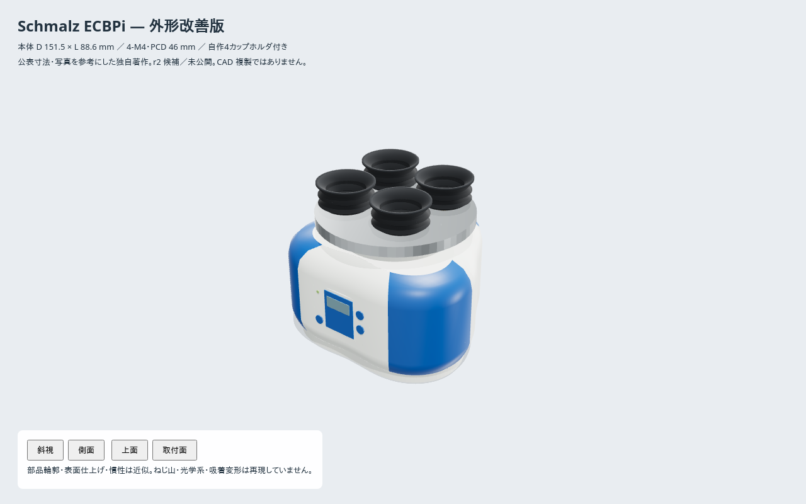

# Schmalz ECBPi — 外形改善版 r2 候補

参照実機は **ECBPi 12 24V-DC M12-8、10.03.01.00314**。
[新しい USD](../usd/vacuum-gripper-ecbpi.usda) を Three.js + three-usd-robot で独自著作。
旧 URDF/STL は r1 の再現用に残す。メーカー CAD・写真・ロゴ・図面は同梱しない。
まだ公開カタログには反映していない。

## 寸法と訂正

| 項目 | メーカー資料 | r2 |
|---|---|---|
| 本体外接径 D | 151.5 mm | 一致。単純な円柱ではなく丸みのある三角断面 |
| 本体高さ L | 88.6 mm | 一致（追加ホルダを除く） |
| ボス D2 | 76 mm | **吸着側**。旧モデルのロボット側配置を訂正 |
| 底面取付 | 図面で4穴、M4 / PCD46、深さ6 mm | **4個の盲穴**。旧3穴を訂正 |
| 本体質量 | 現行資料 775 g | 775 g。旧750 gから訂正 |
| 吸込量 / 最大真空 | 12 L/min / 750 mbar | 既存値を維持 |
| 仕上げ | 製品写真 | 白い筐体・青いコーナー・LCD・金属・ゴムを分離、計8材質 |

出典は [公式製品ページ](https://www.schmalz.com/en/products/automation-743270/vacuum-generators-307617/electric-vacuum-generators-738973/electric-vacuum-generators-end-of-arm-739374/vacuum-generators-ecbpi-308294/10.03.01.00314) と
[公開データシート](https://media.schmalz.com/MAM_Library/Dokumente/Datenblatt_Artikel/1/100/10030100314/bf3c0b7678f4_Datasheet_Article_10.03.01.00314_en-EN.pdf)
（図面: 1ページ、質量: 2ページ）。穴数は図面の読取値。
数値・写真推定・設計値は [provenance.json](provenance.json) に分けた。



[側面](../docs/r2-side.png) · [吸着面](../docs/r2-top.png) · [取付面](../docs/r2-bottom.png)

## 吸着ホルダと互換性

**110 mm の円形プレートと40 mmカップ4個は引き続き当方設計**。
Schmalz の VEE や ROB-SET 完成品の再現ではない。参考製品はポンプ本体のみ。
カップを中空ベローズと薄い接触リップに作り直したが、外径・配置・TCPは旧タスク互換。
TCPは mount から118 mm。追加ホルダの質量推定250 gを加え、合計 **1.025 kg**。
旧1.0 kgや旧10 kg可搬をそのまま保証するモデルではなく、r2レシピから可搬保証値は外した。

**旧 `flange-plate-ecbpi/r1` は3穴なので、新4穴モデルと非互換。**
ISOフランジへ直付けせず、実機に合う4穴のロボット別フランジプレートを確認する必要がある。
未確認のプレート寸法を組み合わせ都合で作り込むことはしない。

## 精度の範囲

筐体輪郭、面取り、部品の継ぎ目、パネル、バヨネット内径・爪、コネクタ、カップ断面は近似。
穴は nominal 径の平滑な盲穴で、ねじ山やはめあいを保証しない。
重心・慣性は旧近似を質量比で更新したもので、実測値ではない。
カップ変形・吸着力・真空流路は未実装。10個の cylinder collision は簡略形状で、
小さな取付穴やカップ内部の空洞は visual のみに表現している。

## 再生成と検証

[共通著作ライブラリ](../../authoring/README.md)を利用するため、リポジトリの共通
`authoring/`も同じチェックアウトに必要。共通部を変更した後も、このディレクトリで
`npm ci`を再実行する。寸法・材質の値・出所は引き続き本モデルに保持する。

```sh
cd vacuum-gripper-ecbpi/authoring
npm ci
npm test
npm run export
npm run view
# http://localhost:8734/viewer.html
```

Node.js 22。表示と USD は `model.mjs` を共有。
テストは本体外接径・高さ、4穴の深さ、中空カップの開口と接触面、質量、材質、再現性を検証。
変換後の追加検証は builder のルートから:

```sh
.venv/bin/python eval/check_authored_fidelity.py vacuum-gripper-ecbpi PACKAGE_DIR
```

[変換後の検証結果](../docs/r2-validation.json) は GLB の実形状、
USD/USDC の材質・法線・衝突形式、URDF/USDC の TCP を読み直した結果。実機試験ではない。
取得元だけを一時ローカルGitに置き換えた全CLIビルドも V2（12 pass / 0 warn / 0 fail）で完了。
[標準検証レポート](../docs/r2-build-validation.json)。リモートの新版取得・公開は未実施。

公開時はアセットを commit/push し、builder の `eval/recipes/vacuum-gripper-ecbpi-r2.yaml`
の `fetch.ref` をフル SHA に固定して `recipes/botrail/` へ移す。旧 r1 は差し替えない。
