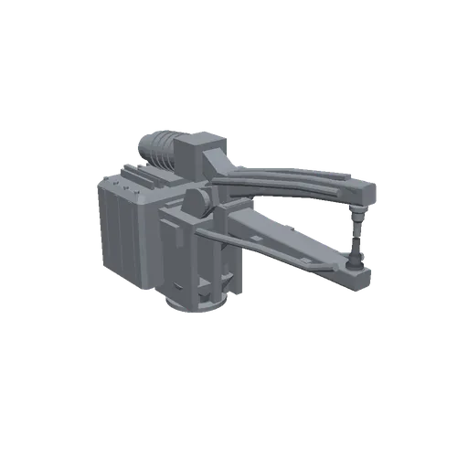

# weld-gun-x16005 — サーボスポットガン (X ガン / シザー式)

自動車 BIW 向け X 型サーボスポットガンの独自著作モデル (CC0-1.0)。
**特定メーカー製品の複製ではない**が、寸法と仕様は**単一の参照実機の公表値**に
合わせてある (下の「参照実機」参照)。



## 参照実機

**HERON DB6-075-X16005-00** — X 型ロボットサーボスポット溶接ガン。
出典: [メーカー公式ページの型番別スペック表](https://heron-welder.com/x-type-robotic-welding-gun-with-servo-actuator/)。
weld-gun-xr637 がストローク出典に使った DB6-110-C16027 と同じ型番体系で、
同一カタログ族から C ガン / X ガンを揃えたことになる。

### 参照実機から採った値

| 項目 | DB6-075-X16005-00 の公表値 | 本アセット |
|---|---|---|
| アーム寸法 (のど深さ x 開口) | **384 x 160 mm** | のど深さ **384** / アーム開口 **160** @電極軸 (一致) |
| 最大ストローク | **179 mm** | 先端移動 **179 mm** (q=0 → 0.446 rad) (一致) |
| 最大加圧力 | **3900 N** | **3900 N** (effort 1650 Nm = 3.9 kN x 腕 0.422 m) (一致) |
| 総質量 | **95.5 kg** | **95.5 kg** (body 78.5 + arm 17) (一致) |
| トランス | **75 kVA** | MFDC 75 kVA 一体型として造形 (一致) |
| 最大電流 | 20 kA | メタデータのみ (形状に影響しない) |
| 包絡 L x H x W | 1161 x 532 x 302 | **非採用** — 外装は独自著作のデフォルメで、本モデルは全長 820 mm 級 |

### 公開規格による補完 (参照実機の公表に無い部分)

| 項目 | 値 | 根拠 |
|---|---|---|
| 電極キャップ | **ISO 5821 Type F, 16 x 20** | 規格表 d1=16 の行: l1=20, R1=40 (先端球面), テーパ 1:10。同規格 ⌀16 の Fmax 4.0 kN >= 3900 N で参照実機の加圧力と整合 |

### 意図的に変えた点

- **q=0 で電極間 5 mm クリアランス** — 実機は閉で電極が接触するが、自己干渉の
  ないゼロ姿勢を保つためのモデリング都合。全開開口は 5 + 179 = 184 mm
- **外装のデフォルメ** — 溶接構造・トランス筐体・配管取り回しは独自著作で、
  参照実機の包絡とは一致させていない

### 参照選定の経緯 (r2 までとの違い)

r2 までは項目ごとに参照が分かれていた (のど深さ = Electroweld 可搬式ガン /
トランス = OBARA DB3-160)。「1 アセット = 1 参照実機」の規約に合わせ、
**型番別スペックを公表している唯一のロボット用 X ガン**として HERON に統一した。
探索の記録: OBARA は寸法非公開 (サイト接続不可・代理店カタログも取得不能)、
Milco はロボット用ピンチガン 638- 系の実在は確認できるが型番別スペック表が
見つからない、ARO 3G はアーム長が差し替えモジュールで型番の属性にならない、
Electroweld は可搬式でクラス違い。

## 構成

X 形 (シザー式) — 固定アームと可動アームがピボットで交差する。

- **1 DOF** (`electrode_joint`, revolute, 軸 `0 -1 0`): 可動電極アーム。
  **正方向 = 開**。`q=0` が閉 (電極間 5 mm)、`q=0.446 rad` (25.6°) が全開
- **リンク**: `mount` (root = フランジ接触面) → `body` → `electrode_arm`。
  `tcp` = 固定電極先端 (body 側の固定子リンク)
- **body**: 取付フランジ板 + ブラケット溶接構造、MFDC トランス (冷却フィン・
  端子箱)、サーボ + ボールねじ駆動、ピボットクレビス、固定アーム + 固定電極
  (上向き)、冷却水マニホールド / ホース / キックレスケーブル
- **electrode_arm**: ピボットブレード + ボールねじ連結テール、可動アーム +
  可動電極 (下向き)、冷却ホース

## 実測値 (tools/measure_throat.py で再現可能)

| 項目 | 値 |
|------|-----|
| のど深さ (電極軸 → ピボットクレビス前面) | 384 mm |
| アーム開口 @電極軸 (q=0) | 160.2 mm |
| 電極間クリアランス (q=0) | 5 mm |
| 電極先端ストローク (q=0 → 0.446 rad) | 179.1 mm |
| 電極間開口 (全開) | 184.1 mm |
| 質量 | 95.5 kg |

のど開口はアームのテーパーに沿って奥へ細くなる (y=0 メッシュ断面の実測):

| 電極軸からの奥行き | 閉 (q=0) | 開 (q=0.446) |
|---|---|---|
| 33 mm | 153 mm | — (全開では先端が手前へ退くため可動側に材料が無い) |
| 113 mm | 133 mm | 311 mm |
| 193 mm | 107 mm | 245 mm |
| 273 mm | 77 mm | 171 mm |
| 353 mm | 40 mm | 84 mm |

## ロボット手首許容値との突合せ (検証 — 参照ではない)

FANUC R-2000iC/165F の公表値に対して全項目が余裕を持って収まる
(重心は mount 基準 z=233 mm、J5 回転中心 → フランジ 215 mm で計算):

| | 本ガン | 許容 (R-2000iC/165F) |
|---|---|---|
| 質量 | 95.5 kg | 165 kg |
| J5 モーメント | 420 Nm | 940 Nm |
| J5 慣性 | 23.9 kg·m² | 89 kg·m² |
| J6 モーメント | 0.3 Nm | 490 Nm |
| J6 慣性 | 4.7 kg·m² | 46 kg·m² |

## visual / collision の分離

- **visual** = `meshes/{body,electrode_arm}.stl`。`tools/generate_meshes.py` が
  生成する手続き的著作物 (trimesh のみに依存、ブーリアン不使用)。寸法定数は
  スクリプト冒頭の GEOMETRY ブロックに集約
- **collision** = URDF のプリミティブ (box / cylinder) のみ、計 12 個。
  **のどの開口を保つのが目的**で、カタログのビルド工程がプリミティブを素通しするため
  VHACD で開口が塞がれない。テーパーしたアームは 2 本の円柱で近似し、先端側を
  細くして開口を稼ぐ。可撓物 (ホース・ケーブル) と機体内部のテールには
  collision を与えていない

検証済み (1.5 mm 薄板をのど中心面 = 電極間中央に差し込んだときの干渉):

| 差込み深さ | 閉 (q=0) | 開 (q=0.446) |
|---|---|---|
| 50 / 150 / 250 / 300 mm | 干渉なし | 干渉なし |
| 350 mm | 干渉 (可動アーム根元) | 干渉なし |
| 400 / 450 mm | 干渉 | 干渉 (のど深さ 384 を超えたのど奥) |

body ↔ electrode_arm の自己干渉は全可動域で無し (ビルド時の joint sweep 検証)。

## メッシュ再生成と実測

```sh
python weld-gun-x16005/tools/generate_meshes.py
python weld-gun-x16005/tools/measure_throat.py
```
