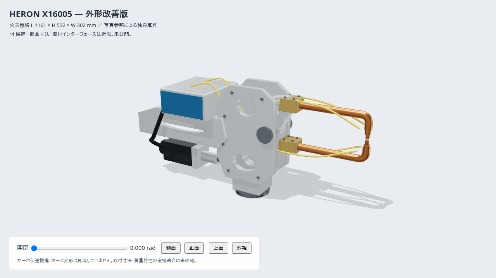

# X16005 外形改善版 — r4 候補

HERON **DB6-075-X16005-00** の公表寸法と、型番が付いたメーカー写真を参照した独自著作モデル。
`../usd/weld-gun-x16005.usda` が新しい入力アセット。旧 `../urdf/` と `../meshes/*.stl` は
r3 の再現用として変更していない。これは未公開の次 rev 候補であり、実機の認証済み CAD ではない。

## 変更点

| 項目 | 旧モデルの実測 | 新モデル |
|---|---|---|
| 全長 L | 823.45 mm | 1161 mm |
| 全高 H | 499.71 mm | 532 mm |
| 全幅 W | 306.00 mm | 302 mm |
| 主な構造 | 下部の大きなトランス・上部の駆動部・長い一体アーム | 肉抜き窓を持つアルミ製キャリア・後部フォーク・上後方トランス・下後方サーボ・湾曲した導電部 |
| 外観 | リンクごとの単色 STL | 9 種類の材質、部品別メッシュ、面取りと曲面法線 |
| collision | 旧モデルのプリミティブ | 新形状に合わせた 17 個の box / cylinder |

根拠は [メーカー仕様表](https://heron-welder.com/x-type-robotic-welding-gun-with-servo-actuator/) と
[メーカー・カタログ](https://heron-spotwelding.com/products/2020-catalogue.pdf) の PDF 7 ページ
(印刷ページ 09–10)、**DB6-075-X16005** と明記された写真。
元画像・寸法図・CAD は同梱しない。公表外形に合わせているのは既存モデル互換の閉姿勢で、
メーカーの包絡測定姿勢自体は公表されていない。

部品寸法や材質の粗さなどは写真に基づく近似である。
[provenance.json](provenance.json) に、公表値・写真からの推定・計算値・未確認事項を分けている。



[全開](../docs/r4-open.png) · [側面](../docs/r4-side.png) ·
[正面](../docs/r4-front.png) · [上面](../docs/r4-top.png)

## 維持したインターフェースと限界

- `mount` → `body` → `electrode_arm`、固定 `tcp`。独立関節は `electrode_joint` の 1 軸。
  ピボット `(0.115, 0, 0.335)` m、軸 `-Y`、範囲 `0–0.446` rad、速度上限 `1.2` rad/s は既存互換。
- `tcp=(0.537, 0, 0.360)` m。閉時の 5 mm 隙間も旧モデル互換として残した。
  **この取付面はメーカー実機の取付寸法を保証しない。** 正式な取付穴・フランジの図面は未確認。
- のど寸法は 384 × 160 mm。資料の 179 mm は英語で stroke、中国語で最大電極開口と表記が異なる。
  今回は旧モデルの先端移動約 179.1 mm を維持するため、全開の電極間は約 184.1 mm。
  公表の最大開口と厳密に一致したモデルとは主張しない。
- 総質量 95.5 kg。部品別質量配分と慣性は近似計算であり、旧 README の手首負荷検証は
  この新形状には引き継がない。メーカー重心表も原点・軸が未確認のため採用していない。
- モータ・ねじ軸は閉姿勢の外観。閉ループ伝達機構、ホースの変形、接触加圧は未実装。
  ホース・ケーブルには collision を付けず、軸受接触と内部テールも衝突近似から除外している。

## 再生成と確認

[共通著作ライブラリ](../../authoring/README.md)を利用するため、リポジトリの共通
`authoring/`も同じチェックアウトに必要。共通部を変更した後も、このディレクトリで
`npm ci`を再実行する。寸法・材質の値・出所は引き続き本モデルに保持する。

Node.js 22 で確認。著作は Three.js + `three-usd-robot`。

```sh
cd weld-gun-x16005/authoring
npm ci
npm test
npm run export
npm run view
# http://localhost:8732/viewer.html
```

`model.mjs` の `DIM` が公表外形・のど寸法・互換フレームの基準。
同ファイルの部品生成と PBR 材質をブラウザ表示と USD 出力で共有する。
衝突形状は別に定義し、USD の Cube / Cylinder として出力するため、URDF でもプリミティブのまま。

builder で変換したパッケージを検証するには、builder の仮想環境で次を実行する。

```sh
# botrail-catalog-builder のルートから。PACKAGE_DIR は新モデルの変換先。
.venv/bin/python ../botrail-assets/weld-gun-x16005/authoring/check_package.py PACKAGE_DIR
```

Node テストは包絡、肉抜き穴、可動方向、質量、衝突形式、出力の再現性を確認する。
パッケージ検証は USD / USDC / GLB / URDF を読み直し、材質・法線・速度上限・FK・
先端移動・薄板挿入・固定部と可動部の衝突を確認する。

ローカル検証結果は [r4-validation.json](../docs/r4-validation.json)。
lockfile からの新規インストールでも 6 テストが成功し、再生成 USD は配布予定の USD と同一 SHA-256。
builder の `eval/recipes/weld-gun-x16005-r4.yaml` と同じ設定で、取得元だけをローカルの
一時 Git スナップショットに替えた CLI ビルドも、fetch から package まで完了した。
[パッケージ標準検証](../docs/r4-build-validation.json) は V2
(12 pass / 0 warn / 12 skip / 0 fail)。生成された USDC に対して下記の追加検証を実施した。
リモートからの取得・公開は未実施。

固定部を障害物として別扱いし、隣接リンクを無視する通常のフィルタを介さずに
51 姿勢で可動部との衝突が無いことを確認した。1.5 mm 薄板は閉／全開とも
350 mm まで挿入可能、400 / 450 mm ではのど奥の衝突近似に当たる。
これは著作した衝突形状の確認であり、実機のクリアランス保証ではない。

公開時はこのアセットを新しいコミットにし、その SHA と USD entry を使った **r4** レシピを追加する。
r3 の entry や形状を新しいものへ差し替えない。`ref: main` のまま公開 rev を固定しないこと。
