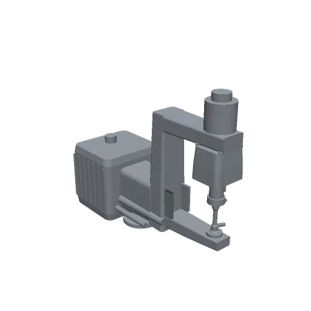

# weld-gun-xr637 — 小型サーボスポットガン (C 型 / 直動)

溶接デモ用のプロセスツール (CC0-1.0)。**特定メーカー製品の複製ではない**が、
寸法と仕様は実機の公表値に一致させてある。X 型の weld-gun-x16005 と
対になる C 型 (直動式)。



## 諸元と、その根拠

| 項目 | 値 | 根拠 |
|---|---|---|
| のど深さ | **225 mm** | Milco XR モジュラー C ガン **637-12402-15** の公表値 (230 × 225 mm) |
| のど開口 | **230 mm** | 同上 |
| 質量 | **84 kg** | 同上 |
| トランス | **MFDC 100 kVA** | 同上 |
| 電極加圧力 | **4.0 kN** | ISO 5821 ⌀16 キャップの `Fmax`。**Milco の枠強度 1100 lbf = 4.9 kN より低い側で、制限しているのはキャップ** |
| 電極キャップ | **ISO 5821 Type F 16 × 20** | 規格表 d1=16 の行 (l1=20, R1=40 球面, テーパ 1:10) |
| ストローク | **80 mm** | HERON DB6-110-C16027 (C 型サーボガン) の 78 mm 相当。TECNA C ガン 3020/3024 の max stroke 75–100 mm とも整合 |
| 自由度 | 1 (prismatic) | 直動式 C ガン |

Milco の同ライブラリにある他の C ガンは 180×345 (80 kg) と 230×315 (90 kg) なので、
**225 mm は Milco C ガン系で最も浅いのど深さ**にあたる。

**寸法図は引用していない。** スポットガンは受注設計で、外形図を公開している
メーカーは無い (weld-gun-x16005 の調査で OBARA / NIMAK / Milco / ARO / Electroweld を
確認済み)。そこで **外観は独自著作のまま、数値だけ公表値に合わせる**方針を採っている。

## weld-gun-x16005 との使い分け

| | weld-gun-x16005 (X 型) | **weld-gun-xr637 (C 型)** |
|---|---|---|
| のど深さ | 384 mm | **225 mm** |
| のど開口 | 160 mm | **230 mm** |
| 関節 | revolute (0〜0.446 rad) | **prismatic (0〜0.080 m)** |
| 質量 | 95.5 kg | **84 kg** |
| TCP の mount からの距離 | 0.647 m | **0.468 m** |

**c1 は手首を打点に寄せられる代わりに、深いところへは入らない。** 逆に
のど開口は 230 mm と広いので、厚いフランジや段差のある継手をまたぎやすい。

手首負荷は FANUC R-2000iC/165F の許容値に収まる:

| | 本ガン | 許容 |
|---|---|---|
| 質量 | 84 kg | 165 kg |
| J5 モーメント / 慣性 | 180 Nm / 11.0 kg·m² | 940 Nm / 89 kg·m² |
| J6 モーメント / 慣性 | **23 Nm** / 5.6 kg·m² | 490 Nm / 46 kg·m² |

**トランスはマウント後方に置いてある。** 喉と同じ高さに座らせると重心がツール軸から
外れて J6 が重くなる (101 → 23 Nm はこの配置の差)。

## BIW (biw-sedan/r6) のフランジに対する実測

`weld-gun-x16005` と同条件で総当たりした (フランジ上 48 点 × 姿勢 48 通り、
ロボットのフランジが車体外にあることを条件に含む):

| フランジ | x1 (のど 400) | **c1 (のど 225)** |
|---|---|---|
| ロッカーディッチ | 24/24 (成立姿勢 11) | 24/24 (**成立姿勢 1〜8**) |
| ルーフディッチ | 24/24 (成立姿勢 11〜24) | **12/24** (成立姿勢 0〜10) |

**c1 は現行の BIW フランジでは x1 より不利。** C フレームは喉を上下と奥の
三方から囲むので、細い 2 本のアームしか無い X ガンより姿勢の自由が少ない。
トランス位置を変えても数値は動かなかったので、これは配置ではなく C 型の性質。

**深い所に届かないことも確認済み**: X ガンで落ちたドア開口内のシル位置
(タブが同じ高さの車体最大幅より 55mm 内側) は、c1 でも 0/4 で成立しない。
のどを浅くしても、電極ホルダが車体に当たる問題は解けない。

用途としては「**開口 230 mm を活かして厚い/段差のある継手をまたぐ**」側で、
アクセスの悪い奥まった継手は x1 の担当になる。

## frames

- `mount` = root。フランジ接触面で、+Z がツール内側。`attach_tool` は root で溶接する
- `tcp` = 固定電極先端 `(0.425, 0, 0.195)`
- `electrode_joint` は **正方向 = 開**。q=0 で電極間 5 mm、q=0.080 で 85 mm
  (x1 の revolute と符号の意味を揃えてある)

## collision

**URDF のプリミティブのみ。のど開口を保つのが目的。** カタログのビルド工程は
プリミティブを素通しするので VHACD で開口が塞がれない。

- アクチュエータは中央にラムの通るボアがあるため**左右 2 枚 + 上蓋**で表す。
  ラムの掃引域は `electrode_ram` 側の collision が受け持つので二重計上しない
- 可撓物 (キックレスケーブル・水配管) には collision を付けない
- 全ストロークで body ↔ electrode_ram の自己干渉なし
- 1.5 mm 板は電極軸から **200 mm 奥まで入り、225 mm で支柱に当たる** —
  宣言しているのど深さと一致する

## 著作

```sh
python weld-gun-xr637/tools/generate_meshes.py   # meshes/{body,electrode_ram}.stl
```

寸法定数はスクリプト冒頭の GEOMETRY ブロックに集約してある。
collision プリミティブと慣性は同じ定数から手で導いて URDF に書いてあるので、
GEOMETRY を変えたら URDF 側も追随させること。

## 出典

- Milco モジュラーガンシステム資料 (ERS Engineering 掲載) — XR C ガンのライブラリ
- HERON C 型ロボット溶接ガン (サーボアクチュエータ付) 諸元表
- TECNA スポット溶接ガン カタログ 16–75 kVA (TJ Snow 掲載) — C ガン 3020/3024
- ISO 5821 (抵抗スポット溶接用電極キャップ)
